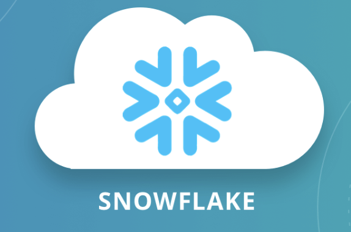

Hi My name is Chiranjeevi Lakkakula
=============================================================================================================================================

Data Engineer  |  Data Warehouse Developer  |  ETL Developer 
-------------
Hello, I am an aspiring Data Engineer who likes to turn Data into Information and Information into Insights.

* 🌍  I'm based in Telangana, India
* ✉️  You can contact with me at [chiranjeevilakkakula@gmail.com](mailto:chiranjeevilakkakula@gmail.com)
* 🧠  I'm learning Snowflake Cloud Platform Administration
* 🤝  I'm open to collaborating on Snowflake Cloud Computing Projects
* ⚡  I'm a great Cook

### Skills

&nbsp;&nbsp;&nbsp;&nbsp;&nbsp;&nbsp;&nbsp;&nbsp;&nbsp;&nbsp;&nbsp;&nbsp;&nbsp;&nbsp;

### Socials

 <a href="https://www.github.com/chiranjeevilakkakula" target="_blank" rel="noreferrer"> <picture> <source media="(prefers-color-scheme: dark)" srcset="https://raw.githubusercontent.com/danielcranney/readme-generator/main/public/icons/socials/github-dark.svg" /> <source media="(prefers-color-scheme: light)" srcset="https://raw.githubusercontent.com/danielcranney/readme-generator/main/public/icons/socials/github.svg" />  </picture> </a> <a href="https://www.linkedin.com/in/chiranjeevi-lakkakula" target="_blank" rel="noreferrer"> <picture> <source media="(prefers-color-scheme: dark)" srcset="https://raw.githubusercontent.com/danielcranney/readme-generator/main/public/icons/socials/linkedin-dark.svg" /> <source media="(prefers-color-scheme: light)" srcset="https://raw.githubusercontent.com/danielcranney/readme-generator/main/public/icons/socials/linkedin.svg" />  </picture> </a>

### About me

* I am an aspiring Data Engineer having profound experience of more than 9 years in fields ETL, Data warehousing, Snowflake Cloud. I worked in a wide variety of domains Banking and Financial Services, Utility,      Manufacturing.
* I work closely with Architects and Business Analysts to transform business requirements into flawless designs and solutions. I hustle every day to turn data into information, and information into insights to 
  meet the strategic decisions for my clients.
* I am a retentive learner and adaptable to new technologies and methodologies. My fast-learning skills helped my client implement sustainable solutions. Very recently a client wanted to build a scheduling 
  mechanism with inbuilt change data capture capabilities within Snowflake cloud, I built this solution leveraging snowflake’s Streams, Tasks which saved the client in buying a third-party scheduling tool.
* I have been acknowledged and acclaimed by management for my significant efforts for performing in challenging environments. I was awarded as top performer for successfully delivering a scalable and sustainable 
  cloud-based data warehouse solution in snowflake embracing clients ever-changing architectural, design changes and concluding the project within agreed timelines.Contributions to my current Data Engineer role, 
  and this field revolve around my essential skills in Data Warehousing, Snowflake Cloud, ETL, SQL, PL/SQL, SnowSQL, Unix Shell Scripting, Abinitio, SQL Server
* I call myself an Optimistic person – Always hope good things will come out of any given situation. Confident and Desirous, always open to adapt to any conditions and advance in personal and professional space.

### Badges

<b>My GitHub Stats</b>

