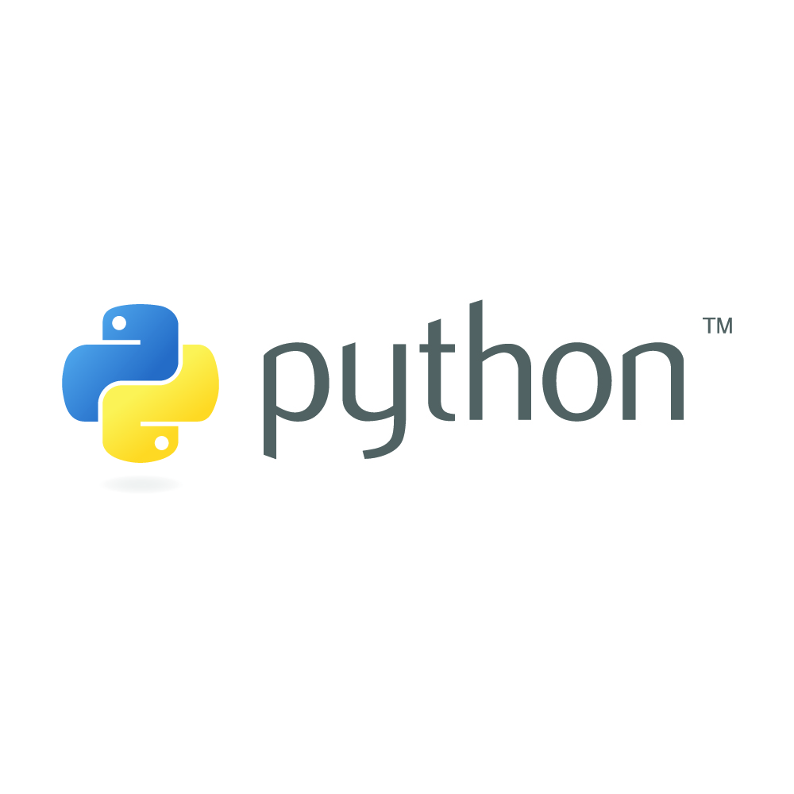

Hi My name is Chiranjeevi Lakkakula
=============================================================================================================================================

_Data Engineer  |  Data Warehouse Developer  |  ETL Developer_
-------------
I am an aspiring Data Engineer with 9+ years professional experience who likes to turn Data into Information & Information into Insights.

* 🌍  I'm based in Telangana, India.
* ✉️  You can contact with me at [chiranjeevilakkakula@gmail.com](mailto:chiranjeevilakkakula@gmail.com)
* 🤝  I'm open to collaborating on Snowflake Cloud Computing Projects.
* 🤘  You can explore data engineering projects on my profile, which I'm developing while mastering their applications.
  
🧑🏻‍🏫 I am currenly learning
* Exploring Modern Data Stack - Python.
* AWS Cloud (S3, Lambda, Glue, Athena).
* How to architectect better data system.

## _My Certifications and Courses_
  * [Snowflake Snow Pro Core Certified](https://www.credly.com/badges/539a6b70-b814-46a3-8619-bfae79218982/public_url)

## _Skills_

&nbsp;&nbsp;&nbsp;&nbsp;&nbsp;&nbsp;&nbsp;&nbsp;&nbsp;&nbsp;&nbsp;&nbsp;&nbsp;&nbsp;&nbsp;&nbsp;&nbsp;&nbsp;

## _Socials_

 <a href="https://www.github.com/chiranjeevilakkakula" target="_blank" rel="noreferrer"> <picture> <source media="(prefers-color-scheme: dark)" srcset="https://raw.githubusercontent.com/danielcranney/readme-generator/main/public/icons/socials/github-dark.svg" /> <source media="(prefers-color-scheme: light)" srcset="https://raw.githubusercontent.com/danielcranney/readme-generator/main/public/icons/socials/github.svg" />  </picture> </a> <a href="https://www.linkedin.com/in/chiranjeevi-lakkakula" target="_blank" rel="noreferrer"> <picture> <source media="(prefers-color-scheme: dark)" srcset="https://raw.githubusercontent.com/danielcranney/readme-generator/main/public/icons/socials/linkedin-dark.svg" /> <source media="(prefers-color-scheme: light)" srcset="https://raw.githubusercontent.com/danielcranney/readme-generator/main/public/icons/socials/linkedin.svg" />  </picture> </a>

## _Recomendations_

